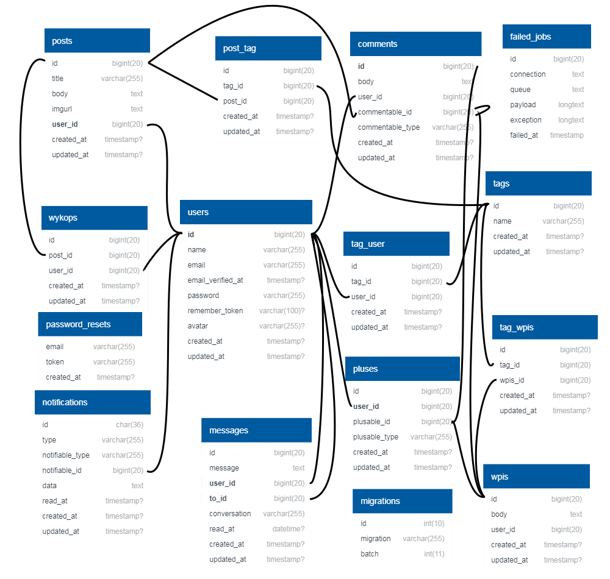

# Laravel Vue SPA app
[http://vps-ba61f06e.vps.ovh.net/](http://vps-ba61f06e.vps.ovh.net/)

## Programming Languages
* PHP
* JavaScript
* HTML
* CSS
## Frameworks
* Laravel 7.2
* Vue 2.6
## Tools/Programs
* Git
* Postman
* Visual Studio Code
* Github
* Google Chrome Debug Console
* Larastan

## Features
* Posts
    - Dig Post
    - Edit
    - Delete
* Microblog
    - Plus Microblog Entry
    - Edit
    - Delete
* Comment
    - Comment Post
    - Comment Microblog Entry
    - Edit
    - Delete
    - Plus
    - Reply
* Messages
* Tags
* Notifications
    - Tag Use
    - Mentioned
    - Follow Tag
* Account
    - Register
    - Login
    - Set Avatar
* Profile
    - User Posts
    - User Microblog Entries
    - User Followed Tags 

## Database

* The "users" table is responsible for storing the users. Contains basic user data. The password is stored in the form of a ciphertext.
* The "posts" table is used to store posts added by users. It contains one relational field - post owner id.
* The "entrys" table contains all user entries. It contains one relational field - entry owner id.
* The "digs" table stores all posts digs. Each "dig" is in the form of a separate record. It contains two relational fields - user id and post id.
* The "messages" table is responsible for storing all messages. Contains basic message data, including the "conversation" field on the basis of which messages are grouped. It contains two relational fields - the id of the user sending the message and the id of the recipient.
* The "comments" table is responsible for storing comments, there is a type of polymorphic relationship here, which means that the table does not have to be closely related to another table, e.g. a separate comment table for posts, separate for replies to another comment, but it can adapt depending on on the type of comment using the "commentable_type" field - this field contains a model, eg "App\Entry", having such information, the application knows that the comment relates to the entry, not a post. Then, the "commentable_id" field is downloaded, which will allow the application to identify which specific entry a comment belongs to. Similar relations were used in the tables "pluses" and "notifications". This allows you to keep all the comments in one table and then relate to them by model.
* The "pluses" table is responsible for storing pluses, it is implemented in the same way as the "comments" and "notifications" tables, by so-called polymorphic relations.
* The "notifications" table is responsible for storing notifications in the system. Each notification contains the following fields: notification type, notification ID, JSON data field, notification read date and notification creation date, the table is implemented in the same way as the "comments" and "pluses" tables, by so-called polymorphic relations.
* The "tags" table stores tags that are written to the database when they are first used in an entry or post. Thanks to the tables: "post_tab", "tag_entry" based on the many to many relation, the application knows in which entry or post specific tags were used. The "tag_user" table - information about tags that the user is watching
* Tables "migrations", "failed_jobs", "password_resets" are the default tables of the Laravel framework

### The website is fully responsive

