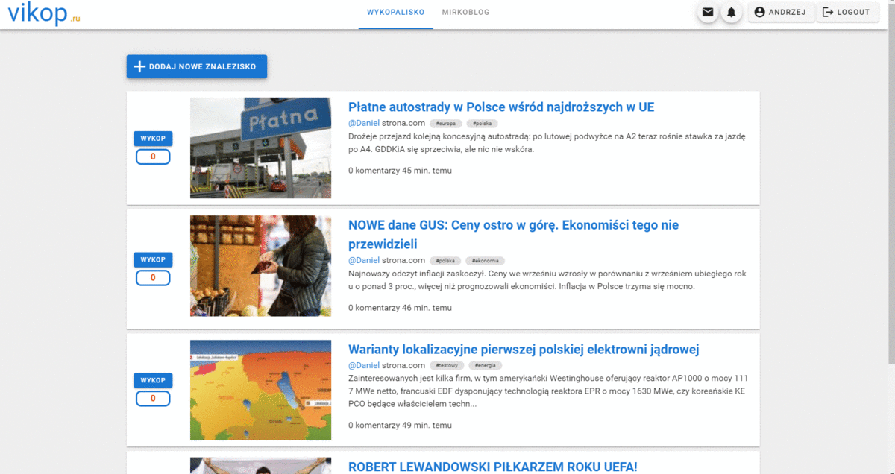
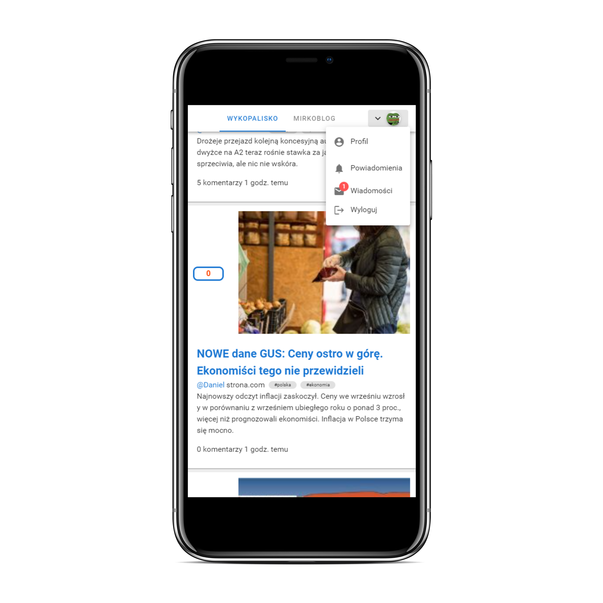

# Laravel Vue SPA app

## Programming Languages
* PHP
* JavaScript
* HTML
* CSS
## Frameworks
* Laravel 7.2
* Vue 2.6
##Tools/Programs
* Git
* Postman
* Visual Studio Code
* github
* Google Chrome Debug Console

## Database

* Tabela „users” jest odpowiedzialna za przechowywanie użytkowników. Zawiera podstawowe dane użytkownika. Hasło przechowywane jest w postaci szyfrogramu.
* Tabela „posts” jest przechowuje posty dodane przez użytkowników. Zawiera jedno relacyjne pole – id właściciela posta.
* Tabela „wpis” zawiera wszystkie wpisy użytkowników. Zawiera jedno relacyjne pole – id właściciela posta.
* Tabela „wykops” przechowuje wszystkie „wykopy” postów. Każdy „wykop” jest w postaci osobnego rekordu. Zawiera dwa relacyjne pola – id wykopującego i id wykopywanego postu.
* Tabela „messages” odpowiedzialna jest za przechowywanie wszystkich wiadomości. Zawiera podstawowe dane wiadomości, w tym pole „conversation”, na podstawie którego grupowane są wiadomości. Zawiera dwa relacyjne pola – id użytkownika wysyłającego wiadomość oraz id adresata.
* Tabela „comments” jest odpowiedzialna za przechowywanie komentarzy, zachodzi tutaj typ relacji polimorficznej, co oznacza, że tabela nie musi być ściśle powiązana z inną tabelą np. osobna tabela komentarzy do postów wpisów, jako odpowiedz do innego komentarza, ale może się dostosować zależnie od typu komentarza za pomocą pola „commentable_type” – w tym polu znajduje się model np. „App\Wpis”, mając taką informacje aplikacja wie, że komentarz tyczy się wpisu, a nie np. postu. Następnie pobierane jest pole „commentable_id”, które pozwoli aplikacji na zidentyfikowanie, do jakiego już konkretnie np. wpisu  należy komentarz. Podobne relacje zostały zastosowane w tabelach „pluses” oraz „notifications”. Pozwala to na trzymanie wszystkich komentarzy, wpisów, notyfikacji w jednej tabeli, a następnie relacyjne powiązanie z nimi po modelu jak zostało wytłumaczone powyżej.
* Tabela „pluses” jest odpowiedzialna za przechowywanie plusów, zaimplementowana jest w taki sam sposób jak tabela „comments” oraz „notifications”, przez tak zwane relacje polimorficzne.
* Tabela „notifications” jest odpowiedzialna za przechowywanie powiadomień (notyfikacji) w systemie. Każde powiadomienie zawiera następujące pola: typ powiadomienia, identyfikator powiadomienia, pole na dane w formacie JSON, datę odczytania powiadomienia oraz datę utworzenia powiadomienia, tabela zaimplementowana jest w taki sam sposób jak tabela „comments” oraz „pluses”, przez tak zwane relacje polimorficzne.
* Tabela „tags” przechowuje tagi, które zapisywane są do bazy w momencie ich pierwszego użycia we wpisie lub poście. Dzięki tabelom: „post_tab”, „tag_wpis” na podstawie relacji many to many aplikacja wie, w jakim wpisie lub poście zostały użyte konkretne tagi. 
Tabela „tag_user” informacje o tym jakie tagi obserwuje dany użytkownik
* Tabele „migrations”, „failed_jobs”, „password_resets” są domyślnymi tabelami frameworka Laravel

### The website is fully responsive

